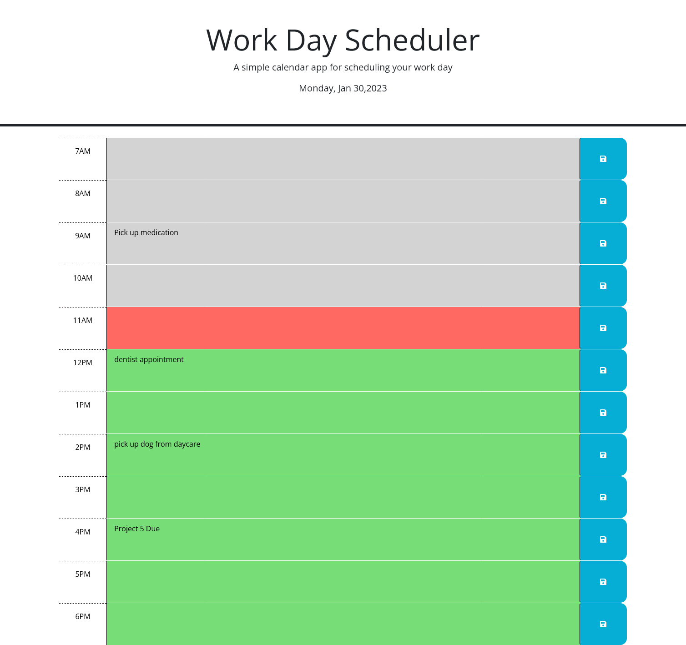

# Java Quiz Sprint

## Description

This challenge was by far the most challenging one I've encountered yet. The basis of this challenge was to create a timed quiz, which required a deep understanding of several programming concepts such as query selectors, event listeners, JSON, and local storage. It was a steep learning curve, but I was determined to understand how these elements are used to create a program like this one.

I spent a significant amount of time researching and experimenting with different techniques to create a functioning quiz. I learned how to use query selectors to target specific elements on a webpage, how to add event listeners to respond to user input, and how to use JSON to store and retrieve data. Additionally, I gained a solid understanding of how to use local storage to save user data for later use. I also learned how to create functions to make the program do what I needed it to do. This included creating functions to handle user input, display questions, and calculate scores. Overall, it was a challenging but rewarding experience.

## Contributors

Kyle Armour

https://kylearmour1.github.io/Java-Quiz-Sprint/

https://github.com/kylearmour1/Organize-Your-Time

